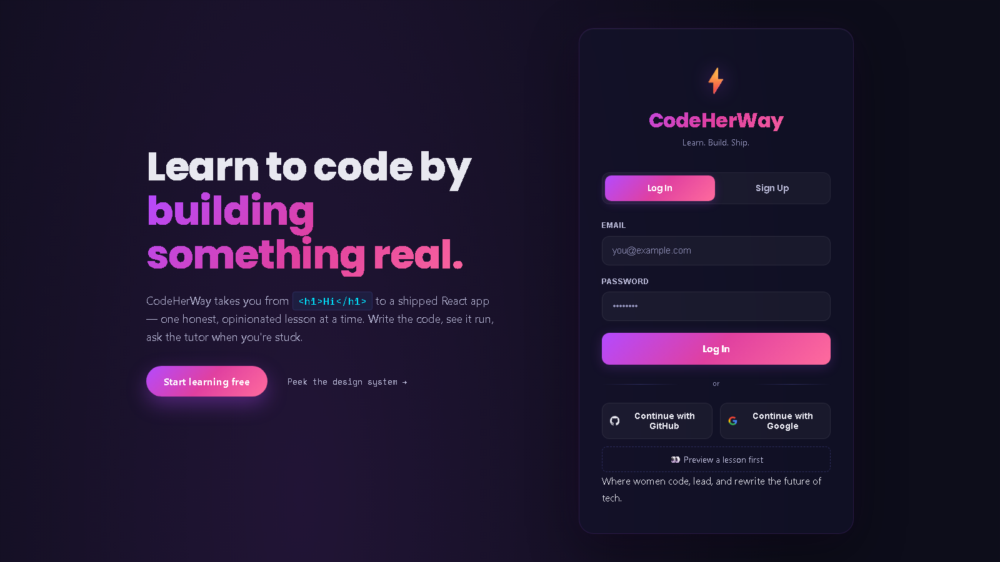

# CodeHerWay

> A free, browser-based coding bootcamp for women learning to ship.
> HTML → CSS → JavaScript → React → Python, with an AI tutor, a real
> code editor, and gamified progress tracking.

**🌐 Live:** https://mellow-sunflower-9c92cd.netlify.app/
**📖 Threat model & security:** [`SECURITY.md`](./SECURITY.md)

[](https://github.com/itcodegirl/education_platform/actions/workflows/ci-smoke.yml)
[](https://github.com/itcodegirl/education_platform/actions/workflows/security-audit.yml)
[](https://react.dev)
[](https://vitejs.dev)
[](https://supabase.com)

<!--
TODO: Add a screenshot here. Drop a PNG/GIF at /docs/screenshot.png and
uncomment the line below. A still of the lesson view + AI tutor side by
side is the highest-impact image you can ship.

-->

---

## What it is

CodeHerWay is a complete coding curriculum that runs entirely in the
browser. Every lesson follows the same opinionated structure —
**hook → do → understand → build → challenge → summary** — and every
lesson ships with:

- a real **Monaco code editor** with live preview in a sandboxed iframe,
- an **AI tutor** that knows the current lesson and can explain the
  student's own code,
- **auto-graded challenges** that validate actual DOM output, and
- **spaced-repetition** review cards generated from missed quizzes.

It's built for women learning to code — past, present, and future.

## What I built (and what it taught me)

This is a portfolio project, but it's a real product. Some of the
decisions I'm proud of:

- **A server-side AI proxy with a Postgres-backed rate limiter.**
  The OpenAI API key never touches the browser. Requests flow through
  a Netlify Function that verifies the user's Supabase session, calls
  a `SECURITY DEFINER` Postgres RPC (`consume_ai_quota()`) that reads
  `auth.uid()` server-side so callers can't spoof another user, and
  prepends a guardrail prompt before forwarding to OpenAI. The
  function fails closed — if the rate limiter is unreachable, the
  request is rejected with 503 rather than burning my OpenAI quota.
- **Row-Level Security on every table.** Twelve Supabase tables, each
  with `auth.uid() = user_id` policies. Admin reads use a separate
  `is_admin()` SECURITY DEFINER function. The React UI is a
  convenience layer; the database itself is the security boundary.
- **An admin escalation guard.** A Postgres trigger blocks any direct
  edit to `profiles.is_admin`. Promotions must go through a
  `set_user_admin()` RPC that refuses self-edits and writes to an
  `admin_audit_log` table. Even a fully compromised admin account
  cannot promote itself silently.
- **A sandboxed code playground.** Learner code runs inside an
  `<iframe sandbox="allow-scripts">` with no `allow-same-origin`, so
  it cannot read the parent origin, cookies, or `localStorage`. I
  wrote the iframe-bridge `console` shim so learners see their
  `console.log` output inline.
- **Per-course code splitting.** Each course's lessons, quizzes, and
  challenges is its own Vite chunk. Studying React doesn't download
  the Python course. Monaco lazy-loads behind a `Suspense` boundary.
- **Chunk-load error recovery.** If a deploy invalidates a dynamic
  chunk while a tab is open, `main.jsx` catches the error, throttles
  via `sessionStorage`, and force-refreshes once. Learned the hard way.
- **A real design system.** Brand palette, 8pt spacing grid, fluid
  type scale with `clamp()`, gradient tokens — all defined as CSS
  custom properties from a `platform_design.docx` brand doc.
- **PWA with offline indicator and update-available prompt.** Service
  worker registers, auto-refreshes on update, posts `SKIP_WAITING`
  to take over without reload loops.
- **Hardened HTTP headers.** Strict CSP, HSTS, COOP/CORP, frame-deny,
  referrer policy, and a restrictive permissions policy — all in
  `netlify.toml`.

If you'd like the deeper version, the [security audit commits](https://github.com/itcodegirl/education_platform/commits/main)
walk through the threat model and the fixes I made.

## Tech stack

| Layer | Choice | Why |
| --- | --- | --- |
| UI | React 18 + Vite 6 | Fast HMR, modern bundler, real code-splitting |
| Editor | `@monaco-editor/react` | Same editor that powers VS Code |
| Backend | Supabase (Postgres + Auth + RLS) | Real auth + a real database without a server |
| Functions | Netlify Functions (Node 20 ESM) | One platform, scheduled jobs included |
| AI | OpenAI Responses API (gpt-4o-mini) | Behind an authenticated proxy |
| E2E | Playwright | Already wired into CI |
| CI | GitHub Actions | build · smoke tests · `npm audit` · `gitleaks` · weekly ops checks |

## Architecture at a glance

```
Browser (React 18, PWA)
   │
   ├─── REST ────▶ Supabase  (Postgres + Auth + RLS)
   │
   └─── fetch ───▶ Netlify Functions
                       ├─ /ai            auth + rate limit + guardrail → OpenAI
                       └─ /streak-reminder  daily cron, shared-secret protected
```

Every arrow above is gated by something — a Supabase JWT, an RLS
policy, a Postgres trigger, a CSP, or an HMAC-style shared secret.
The full picture lives in [`SECURITY.md`](./SECURITY.md) and
[`supabase-schema.sql`](./supabase-schema.sql).

## Run it locally

```bash
git clone https://github.com/itcodegirl/education_platform.git
cd education_platform
npm ci
cp .env.example .env       # then add your Supabase URL + anon key
npm run dev                # http://localhost:5173
```

The AI tutor is disabled in local dev unless you also run
`netlify dev` with `OPENAI_API_KEY` set. The full env reference is in
[`.env.example`](./.env.example).

### One-time database setup

Open your Supabase project's SQL Editor, paste
[`supabase-schema.sql`](./supabase-schema.sql), and run it. It's
idempotent — re-running is safe.

```sql
-- Promote yourself as the first admin (run once, in Supabase Studio):
update public.profiles set is_admin = true where id = '<your-uuid>';
```

After bootstrap, every subsequent admin change must go through the
`set_user_admin()` RPC, which refuses self-edits.

## Scripts

| Script | What it does |
| --- | --- |
| `npm run dev` | Vite dev server |
| `npm run build` | Production build to `dist/` |
| `npm run preview` | Preview the production build |
| `npm run test:e2e` | Run Playwright E2E suite |
| `npm run test:e2e:ui` | Playwright in UI mode |

## Project layout

```
src/
├── components/   learning · panels · auth · admin · gamification · layout
├── services/     auth · progress · gamification · AI · learning engine
├── lib/          supabase client
├── data/         course content (HTML · CSS · JS · React · Python)
├── providers/    Auth · Theme · Progress
├── routes/       AppRoutes
├── hooks/        useIsMobile · useKeyboardNav · useNavigation · usePanels
├── utils/        markdown · iframeStyles · monacoTheme
└── styles/       design tokens + global styles
netlify/functions/  ai.js (proxied, rate-limited) · streak-reminder.js
supabase-schema.sql tables · RLS · triggers · RPCs · audit log
.github/workflows/  ci-smoke · security-audit · ops-checks
```

## Security highlights

- 🔒 **No secrets in the bundle.** OpenAI key lives only in Netlify env vars.
- 🔒 **Authenticated AI proxy** with Postgres-backed per-user rate limit, payload caps, and a mandatory server-side guardrail prompt.
- 🔒 **Row-Level Security** on every Supabase table.
- 🔒 **Admin escalation guard** — Postgres trigger + `set_user_admin()` RPC + `admin_audit_log`. Admins cannot promote themselves.
- 🔒 **XSS-hardened markdown renderer** — escape first, then format. CSP is the safety net.
- 🔒 **Sandboxed code playground** — `allow-scripts` only, no `allow-same-origin`.
- 🔒 **Strict HTTP headers** — CSP, HSTS (2y + preload), COOP, CORP, frame-deny, referrer policy, permissions policy.
- 🔒 **Supply chain** — committed lockfile, weekly `npm audit` + `gitleaks`, Dependabot.

Full threat model and disclosure process: [`SECURITY.md`](./SECURITY.md).

## Roadmap

- [ ] Public progress pages (`/u/:handle`) with shareable OG cards
- [ ] AI-generated personalized practice quizzes from missed concepts
- [ ] Animated landing-page hero with scroll-driven storytelling
- [ ] Self-host fonts to drop `'unsafe-inline'` from the style CSP
- [ ] Migrate `src/` to TypeScript

## Contributing

PRs welcome — especially new lessons, accessibility fixes, and
security improvements. CI must pass (`ci-smoke`, `security-audit`).
For security issues, **do not open a public issue** — see
[`SECURITY.md`](./SECURITY.md).

## Design system preview

Every color, spacing value, type size, radius, and motion curve lives
in [`src/styles/tokens.css`](./src/styles/tokens.css). Preview them
live at `#styleguide` — the page is public (no auth required) and
intended to be linkable during design review:

```
http://localhost:5173/#styleguide
https://mellow-sunflower-9c92cd.netlify.app/#styleguide
```

## License

MIT — see [`LICENSE`](./LICENSE).

---

Built by [@itcodegirl](https://github.com/itcodegirl) for women who
code, lead, and rewrite the future of tech.
